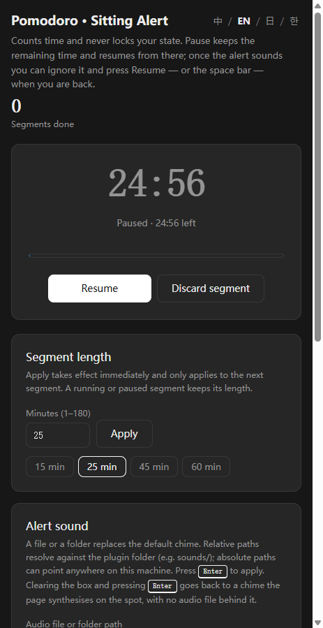
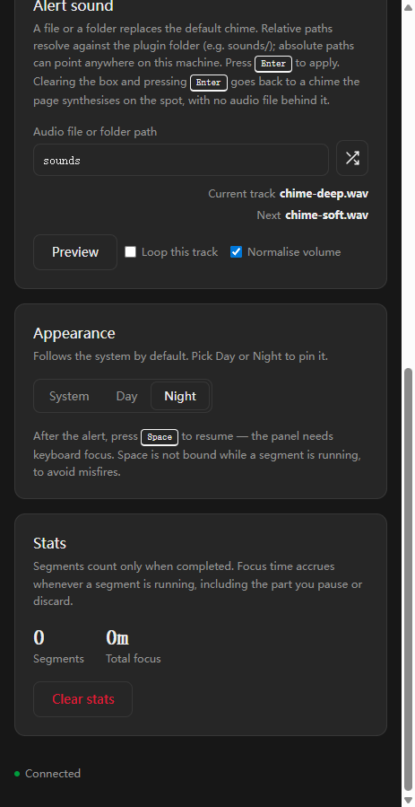

# Pomodoro Sit Reminder

English | [简体中文](README.zh-CN.md)

A Pomodoro timer that only counts. When a work segment ends it shows an in-page sit reminder and plays a sound, but it never locks the timer and never enforces a rest length — walk away for as long as you like, then press **Resume** when you are back.

Author: [1602WinXP](https://github.com/1602WinXP) · Version: `1.0.0`

*Both captured in MiniMax Code on Windows at a 463 px panel width, with the interface in English and the session statistics cleared to zero so no personal data is shown. The alert sound is the bundled `sounds/` folder, playing in order with volume normalisation on; the track rows show an audition, so **Next** names the file the following **Preview** press would fetch. The app is in dark mode.*

## What it does

- **Segment length** — 1–180 minutes, with 15 / 25 / 45 / 60 presets. `Apply` only affects the next segment; a running or paused one keeps its length.
- **Sit alert** — fires when the segment elapses, in the page only. No notification permission, no lock screen, no forced break. **Pause** keeps the remaining time and resumes from there.
- **Resume** — one button starts the next segment whenever you are ready.
- **Stats** — completed segments and total focus time, with a **Clear stats** button.
- **Alert sound** — a single audio file or a whole folder, in order or shuffled, with single-track loop and volume normalisation. See below.
- **Interface language** — 中文 / English / 日本語 / 한국어.
- **Colour mode** — System / Day / Night.

## Install and use

Copy this whole directory, including the hidden `.minimax-plugin` directory, into `.minimax/plugins/` inside your home folder:

| System | Target path |
| --- | --- |
| Windows | `C:\Users\<username>\.minimax\plugins\pomodoro-sit-timer` |
| macOS | `/Users/<username>/.minimax/plugins/pomodoro-sit-timer` |
| Linux | `/home/<username>/.minimax/plugins/pomodoro-sit-timer` |

`.minimax` is hidden: enable "Show hidden items" in File Explorer, or press `Cmd + Shift + .` in Finder. If MiniMax Code has run before, the folder already exists. If you use a custom data directory (`MINIMAX_DATA_DIR`), put the plugin under `plugins/` there instead.

Restart MiniMax Code, confirm the plugin is enabled, then open the app. The page is titled **Pomodoro · Sitting Alert** when the interface language is English; the plugin itself is listed under the display name `番茄钟 · 久坐提醒`, which is also the name its example queries use.

To update, close the app, exit MiniMax Code, and replace the whole plugin directory. To uninstall, do the same and delete the directory; app data stored outside it may remain.

## Alert sound

The **Audio file or folder path** box accepts either a **single file** or a **folder**. A folder is scanned one level deep, keeps `.mp3` / `.wav` / `.ogg` only, and is sorted by name so that `2.mp3` comes before `10.mp3`.

Leave it blank and the alert uses a chime the page **synthesises on the spot** — three sine tones (G5, C6, E6) built with the Web Audio API. There is no audio file behind it and no request leaves the machine. The same chime is used whenever a configured file cannot be read, so a moved or deleted track never silences the alert. The three `sounds/chime-*.wav` files shipped with this package are **samples, not a fallback**: they are only heard if you point the box at them.

- **In order / Shuffle** — the icon button next to the path box toggles between the two. Shuffle reorders the whole folder each time you get through it, so a pass never repeats a track and never skips one.
- **Loop this track** — locks playback to one file. The lock lives on the server, so the file plays once per alert and stays put across restarts. While it is on, the order/shuffle button is disabled, and **Preview** plays the pinned track too. Turning it off does not change the song: playback carries on from the track you were listening to and moves on to the next one from there.
- **Normalise volume** — on by default, and it works in **both directions**: quiet tracks are lifted and loud ones are brought down, so a quiet folder and a loud folder play at the same level. One track is measured and becomes the target level for the whole playlist. That track is whichever one is playing the first time normalisation reaches your audio — on a fresh install, the first track you play; if you tick the box yourself, the one you are listening to at that moment, so un-ticking and re-ticking re-picks it. The measured level is clamped to 0.25–0.89, kept in browser storage, and reused across restarts and across folders. Gain is capped at 40×, and a near-silent file is never chosen as the reference.
- **Preview** — plays the next file in the running order rather than the one that is armed, so you can walk the whole folder. It does not change what the next real alert will play.
- **Current track / Next** — the two rows above the button name the file playing now and the file the next **Preview** press will fetch, so the button is not a black box. **Next** reads `–` whenever there is nothing distinct to fetch — a lock is on, a single file is configured, or no file at all — instead of repeating the name above it. Both rows stay on screen in every state, so the card keeps its height as you press. A long file name is shortened from the front, which keeps the extension readable; hover the current-track row for its full path.
- **Applying a path** — press Enter in the path box. There is no permanent Apply button: Enter commits, and clearing the box and pressing Enter goes back to the synthesised chime described above. A tick appears beside the box while an edit is unsaved and disappears once it is committed or reverted, and pressing the tick commits as well.

A path such as `sounds` is resolved against the installed plugin directory, and a relative path cannot escape it. Because the client runs from a fresh temporary copy on every start, relative paths are re-resolved at launch rather than saved as absolute ones — an absolute path saved earlier would point at a directory that no longer exists. An absolute path is still accepted and may point anywhere on your machine.

Three sample tones ship in `sounds/` (`chime-soft`, `chime-bright`, `chime-deep`).

## Tested environment

MiniMax Code desktop **3.1.1** on Windows (10.0.26200, x64). The repository's own docs are written against 3.0.73; this package was built and tested on 3.1.1.

Verified during development, in the client's own embedded browser at a 463 px viewport: install and open; countdown across 1 / 15 / 25 / 45 / 60 minutes; the alert firing with sound; **Resume** starting the next segment; **Pause** holding the remaining time; stats and clearing them; folder playback in both in-order and shuffle modes; the single-track lock, including that Preview follows it and that releasing the lock carries on from the same track in both modes; a long file name held to the card without overflowing it; a relative sound path still resolving after a client restart; volume normalisation; all four interface languages; all three colour modes.

**Unverified:** macOS and Linux. The audio path handling, the temporary-directory resolution and the layout have not been exercised on either.

## Data & access

- **Files read** — the audio file or folder you type into the sound box, read-only. The runtime also reads `sounds/` inside the installed plugin directory for the bundled samples. Nothing else on disk is touched; there is no scanning of your music library. A relative path is locked inside the plugin directory, but **an absolute path may point anywhere on your machine** — see the Alert sound section above for that boundary.
- **Files written** — exactly one: a `state.json` under the directory the Host passes as `context.dataDir`, holding the duration, phase, remaining time, completed-segment count, accumulated focus seconds, and your sound settings. The path comes from `context.dataDir` alone — nothing is hardcoded or walked up from — and nothing outside that directory is written. Each save writes a `state.json.tmp` beside it and then renames over `state.json`, so a reader always sees a complete file rather than a half-written one, and saves are chained so two of them cannot interleave.
- **Browser storage** — view preferences only: interface language, colour mode, whether volume normalisation is on, and the measured reference level. No timer or session data.
- **Network** — none. The runtime makes no outbound requests and has no telemetry.
- **Subprocesses** — none.
- **Configuration** — no API key, no account, no setup.

The page shows only your own timer and your own stats. Because the alert is in-page, a segment that ends while the MiniApp tab is in the background may go unnoticed until you look at it again. After the alert, `Space` resumes work when the panel has keyboard focus; it is deliberately unbound while a segment is running, to avoid misfires.

## Source and verification

The page is `miniapp/client/index.html` (no framework, no CDN, no build step — it works offline), the Node entry is `miniapp/node/server.mjs`, and the Host API type definitions used for editor type-checking are in `miniapp/node/miniapp-api.ts`. There are no third-party runtime dependencies.

## License

[MIT](LICENSE).
