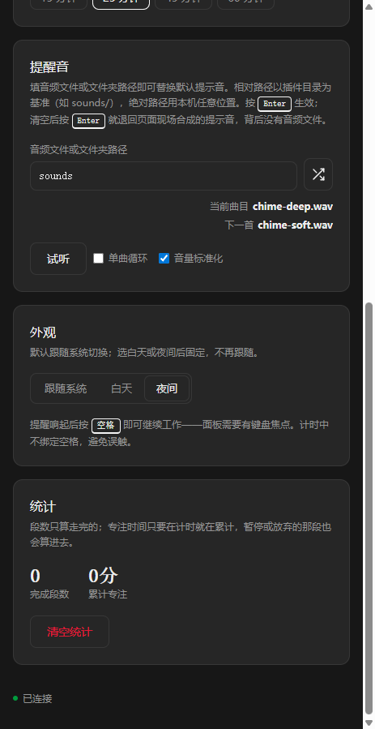

# 番茄钟 · 久坐提醒

[English](README.md) | 简体中文

一个只负责计时的番茄钟。工作段走完时在页面内弹出久坐提醒并播放提示音，但**不锁状态、不限制休息时长** —— 你想走多久走多久，回来点一下「继续」就开始下一段。

作者：[1602WinXP](https://github.com/1602WinXP) · 版本：`1.0.0`

*两张均在 MiniMax Code（Windows）面板宽 463 px 下实机截取，会话统计已清零，不含个人数据。提醒音是内置的 `sounds/` 文件夹，顺序播放、音量标准化已开启；曲目那两行显示的是一次试听，所以「下一首」写的是再按一次「试听」会取到的那一首。界面为夜间模式。*

## 功能

- **工作段** —— 1–180 分钟，另有 15 / 25 / 45 / 60 快捷档。
- **久坐提醒** —— 工作段结束时在页面内触发。不要通知权限，不锁屏，不强制休息。
- **继续** —— 你准备好了就按一下，直接开始下一段。
- **统计** —— 完成段数与累计专注时长，可一键清空。
- **提醒音** —— 单个音频文件或整个文件夹，可顺序 / 随机播放，支持单曲循环与响度匹配。详见下节。
- **界面语言** —— 中文 / English / 日本語 / 한국어。
- **配色** —— 跟随系统 / 白天 / 夜间。

## 安装与使用

把整个目录（**含隐藏的 `.minimax-plugin` 目录**）复制到用户主目录下的 `.minimax/plugins/`：

| 系统 | 目标路径 |
| --- | --- |
| Windows | `C:\Users\<用户名>\.minimax\plugins\pomodoro-sit-timer` |
| macOS | `/Users/<用户名>/.minimax/plugins/pomodoro-sit-timer` |
| Linux | `/home/<用户名>/.minimax/plugins/pomodoro-sit-timer` |

`.minimax` 是隐藏目录：Windows 上需在文件资源管理器开启「显示隐藏的项目」，macOS 上按 `Cmd + Shift + .`。只要用过 MiniMax Code，这个目录通常已经存在。如果配置了自定义数据目录（`MINIMAX_DATA_DIR`），请放到该目录下的 `plugins/` 里。

然后重启 MiniMax Code，确认插件已启用，打开「番茄钟 · 久坐提醒」，或直接让 Agent 帮你打开。

更新时先关闭应用并退出 MiniMax Code，再整体替换插件目录。卸载同理，删除该目录即可；存放在目录之外的应用数据可能仍会保留。

## 提醒音

路径框既可以填**单个文件**，也可以填**文件夹**。文件夹只扫描一层，只保留 `.mp3` / `.wav` / `.ogg`，按文件名排序（所以 `2.mp3` 会排在 `10.mp3` 前面）。

**留空时提醒音是页面现场合成的** —— 三个正弦音（G5、C6、E6），用 Web Audio 接口生成，**背后没有任何音频文件，也没有任何请求离开本机**。配置的文件读不出来时用的也是它，所以音频被移动或删除都不会让提醒静默。随包发的 `sounds/chime-*.wav` 是**示例、不是回落音**，只有你把路径框指向它们时才会响。

- **顺序 / 随机** —— 路径框右边的图标按钮在两者之间切换。随机模式每走完一轮就重新洗牌，因此一轮之内既不重复也不遗漏。
- **单曲循环** —— 把播放锁定在某一个文件。锁定状态存在服务端，所以每次提醒只播一遍，且跨重启保持。锁定期间模式按钮会被禁用，**试听**也只播锁定的那一首。取消勾选**不会换歌**：从你正在听的那一首接着往下走，下一次就是它后面的那一首。
- **音量标准化** —— 默认开启，且**双向**作用：安静的抬起来，响的压下去，所以安静的目录和响的目录听起来一样大。它会量出一首的峰值，当作整个播放列表的目标音量。被量到的那一首，是标准化第一次对你的音频生效时正在播的那首 —— 刚装上时就是第一次播放的那首；如果你自己勾上这个框，就是勾上那一刻正在听的那首（所以取消再勾一次就能换一首）。量出的值钳制在 0.25–0.89，存在浏览器存储里，跨重启、换目录都沿用。放大倍数上限 40×，接近静音的文件不会被选为基准。
- **试听** —— 播放当前顺序里的下一首，而不是已布防的那一首，方便你把整个文件夹听一遍。它不会改变下一次真实提醒播放的内容。
- **当前曲目 / 下一首** —— 按钮上面两行，分别写明现在放的是哪一首、再按一次「试听」会取哪一首，所以这个按钮不是黑盒。**没有第二首可取时**（锁定了、只配了一个文件、或者根本没配文件），「下一首」写 `–`，而不是把上面那行再抄一遍。两行在任何状态下都在，**卡片高度不会因为你按了按钮而变化**。文件名过长时从开头截断，扩展名始终可读；把鼠标停在当前曲目那一行可以看到完整路径。
- **应用路径** —— 在路径框里按回车，没有常驻的「应用」按钮：回车即生效；清空路径再按回车就退回上面那个合成提示音。有未保存的改动时，路径框右边会出现一个勾，提交或还原后消失，点它同样是提交。

像 `sounds` 这样的相对路径以插件安装目录为基准解析。由于客户端每次启动都运行在全新的临时副本里，相对路径会在启动时重新解析，而不是把绝对路径存下来 —— 之前存下的绝对路径指向的目录届时已经不存在了。

`sounds/` 里附带三个示例音（`chime-soft`、`chime-bright`、`chime-deep`）。

## 已验证环境

MiniMax Code 桌面版 **3.1.1**，Windows（10.0.26200，x64）。本仓库文档以 3.0.73 为基准，本插件在 3.1.1 上开发并测试。

开发过程中在客户端自带浏览器、463 px 视口下验证过：安装与打开；1 / 15 / 25 / 45 / 60 分钟的倒计时；提醒触发并响铃；「继续」开启下一段；统计与清空；文件夹的顺序与随机播放；单曲锁定（含试听跟随锁定、以及顺序与随机两种模式下取消锁定都从同一首接着走）；超长文件名不会撑出卡片；相对路径在客户端重启后仍能解析；响度匹配；四种界面语言；三种配色。

**未验证：** macOS 与 Linux。音频路径处理、临时目录解析与页面布局在这两个系统上都没有实测过。

## 数据与访问范围

- **读取的文件** —— 你填进声音路径框的音频文件或文件夹，只读。运行时还会读取插件安装目录下的 `sounds/` 以取用内置示例音。除此之外不触碰磁盘任何位置，也不会扫描你的音乐库。相对路径锁死在插件目录内，但**绝对路径可以指向本机任意位置** —— 边界见上文「提醒音」一节。
- **写入的文件** —— 只有一处：`context.dataDir` 指向的目录下的 `state.json`，记录时长、阶段、剩余时间、完成段数、累计专注秒数以及你的提醒音设置。路径完全取自 `context.dataDir`，不硬编码也不向上拼接，该目录之外一律不写。每次落盘先写同目录的 `state.json.tmp` 再 rename 覆盖 `state.json`，所以读到的永远是完整一份而不是写了一半的内容；多次落盘经由一条链串行，不会两次写交叉。
- **浏览器存储** —— 只存界面偏好：语言、配色、响度匹配开关，以及实测得到的参考音量。不存计时或会话数据。
- **网络** —— 无。运行时没有任何对外请求，也没有遥测。
- **子进程** —— 无。
- **配置** —— 不需要 API key、不需要账号、不需要任何设置。

页面只显示你自己的计时和统计。由于提醒发生在页面内，工作段结束时若 MiniApp 标签页在后台，可能要等你回来看才会发现。

## 源码与验证情况

页面是 `miniapp/client/index.html`（无框架、无 CDN、无构建步骤，离线可用），Node 入口是 `miniapp/node/server.mjs`，供编辑器类型检查用的 Host API 类型定义在 `miniapp/node/miniapp-api.ts`。没有任何第三方运行时依赖。

## 许可

[MIT](LICENSE)。
