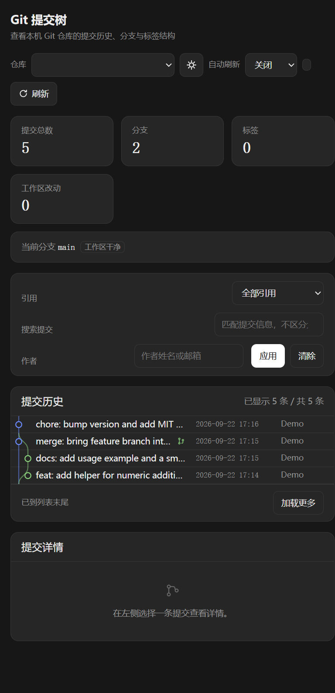

# Git 提交树

[English](README.md) | 简体中文

在 MiniMax Code 里查看本机 Git 仓库的提交历史：泳道提交图、分支与标签、提交详情和文件改动统计,支持自动刷新与筛选偏好持久化。

作者:Microbiosis · 版本:`1.1.0`



## 安装与使用

将本目录完整复制到 MiniMax Code 当前数据目录下。`<dataDir>` 默认为用户主目录下的 `.minimax`,即 `~/.minimax`,默认安装路径:

```text
<dataDir>/plugins/git-tree/
```

保留 `.minimax-plugin/` 隐藏目录。重新启动支持 Mini App 的 MiniMax Code,确认插件已被识别并启用,然后打开「Git 提交树」,或在对话中请求打开它。

页面默认加载当前仓库最近 200 条提交(可在 `repos.json` 中配置)。通过引用下拉过滤分支或标签,用搜索框匹配提交信息,用作者框匹配作者,用「自动刷新」下拉保持视图与新推送同步。

## 页面分区

| 区域 | 数据来源 | 说明 |
|---|---|---|
| 统计卡片 | `git rev-list --all --count`、`for-each-ref`、`tag --list`、`status --porcelain` | 提交总数、分支数、标签数、工作区改动数 |
| 工作区条 | `git status --porcelain` | 当前分支 + 前 6 个改动路径 chip |
| 提交图 | `git log --topo-order` + 自定义泳道算法(移植自 `zai-org/ZCode`) | 单 SVG canvas:path、dot、选中环、悬停高亮 |
| 提交行 | `git log` + `git tag --contains` | 4 列网格(refs+subject / date / author / hash);refs chip 用 `is-head`、`is-tag` 区分边框色 |
| 行内详情(可折叠) | 服务端 `/api/commit` | 标题、refs、文件改动表、body — 出现在列表下方,可折叠 |
| 右侧详情(常驻) | 服务端 `/api/commit` | 同上行内;选中态与行内互相独立 |

## 数据源与缓存

- **仓库列表**:`repos.json` 与插件同发,默认空(刻意保留)。每次安装需自行声明本地路径:在 `repos` 数组里列出,或把 `scanRoots` 设为包含 `.git` 的一层目录。Node 入口从插件根和工作目录向上找 `.git`,再扫一次 `scanRoots` 的一层目录验证。**可移植性回退**:如果 `repos.json` 与向上找都没产出任何 scanBase,自动再扫 `~/Code`、`~/Projects`、`~/repos`、`~/workspace`、`~/src`、`~/source`、`~/dev`、`~/work`、`~/Documents`、`~/git`(Windows/macOS 下大小写不敏感)。Windows 上额外扫描每个挂载的盘符根(`A:\` 到 `Z:\`),因为开发者常把项目放在非系统盘的 `D:\` / `E:\` 上。Windows 系统目录(`Program Files`、`Windows`、`Users`、`ProgramData`、`$Recycle.Bin` 等)和 macOS 资源目录(`Library`、`Applications`、`System`)会被过滤掉,所以扫描盘符根不会进入 `%ProgramFiles%`。回退只在没有其他发现源时才启用,有 `repos.json` 的用户完全不受影响。
- **统计**:7 个并行 `git` 命令(`log -n 1`、`rev-list --all --count`、两次 `for-each-ref`、`tag --list`、`status`、`log -n 1 --format=%D`),按仓库缓存 **30 秒**。
- **提交图**:`git log <ref> --topo-order` + 可选 `--grep` / `--author`,每次请求上限 **400** 行。布局结果由服务端校验,客户端用单 SVG 渲染。
- **提交详情**:`git show -s` + `git show --numstat` + `branch --contains` + `tag --contains`,按 `(repo, sha)` 缓存 **60 秒**。客户端镜像同一缓存,重复点同一条提交零成本。
- **图的标签**:`git log --all --simplify-by-decoration --format=%H %D`,按仓库缓存 60 秒。
- **响应压缩**:API 响应 ≥ 256 字节且客户端带 `Accept-Encoding: gzip` 时自动 gzip。
- **超时分级**:快速读(`for-each-ref`、`tag --list`、`--contains`)10 秒;中速读(`log -n 1`、`status`、`git show`)15 秒;重量级读(`log --topo-order --all`、`rev-list --all --count`)30 秒。客户端 `api()` 用 `AbortController` 兜底 35 秒。

## 偏好持久化

筛选条件和主题写入 `<dataDir>/prefs.json`,下次打开自动恢复:

| 键 | 类型 | 默认 | 说明 |
|---|---|---|---|
| `theme` | `auto` \| `light` \| `dark` | `auto` | `auto` 跟随系统 `prefers-color-scheme` |
| `repo` | 绝对路径 | 第一个仓库 | 若保存的路径已不在仓库列表,回退到默认 |
| `ref` | 字符串 | `all` | `all`、分支名或标签名 |
| `q` | 字符串 | `""` | 提交信息子串搜索 |
| `author` | 字符串 | `""` | 匹配作者名或邮箱 |
| `interval` | `0` \| `5` \| `10` \| `30` \| `60` | `0` | 自动刷新间隔(秒) |

`/api/prefs` 用 GET 读、POST 合并写(不会清空其他字段)。客户端写 400 ms 防抖。

## 自动刷新

「自动刷新」设为 5 / 10 / 30 / 60 秒后,页面原地重新拉取 overview 和 graph,选中行、滚动位置、行内详情全部保留。刷新按钮旁的倒计时 chip 显示距离下次自动刷新的秒数;手动刷新按钮任意时刻可用。

## 源码与验证

页面位于 `miniapp/client/index.html`(单文件、单 SVG canvas、行内脚本),Node 入口位于 `miniapp/node/server.mjs`,泳道算法位于 `miniapp/node/git-graph.mjs`。

无需构建。已验证环境:MiniMax Code 桌面端 `3.0.73.166`,Windows(10.0.26200,x64)。macOS 与 Linux 未验证。

## 许可证

[Apache-2.0](LICENSE)。

`miniapp/node/git-graph.mjs` 中的泳道布局算法是 [`zai-org/ZCode`](https://github.com/zai-org/ZCode) 的 `packages/ui/src/git-graph/layoutAlgorithm.ts` 与 `packages/ui/src/git-graph/layout.ts` 的 JavaScript 移植,上游以 Apache-2.0 许可,原作者 Z.ai / zai-org 贡献者。
